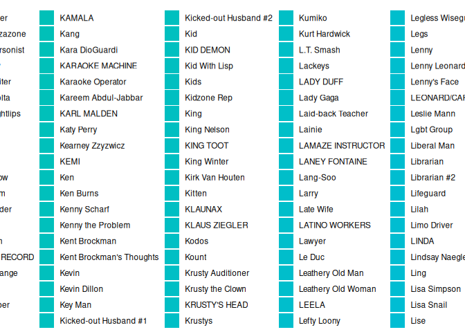
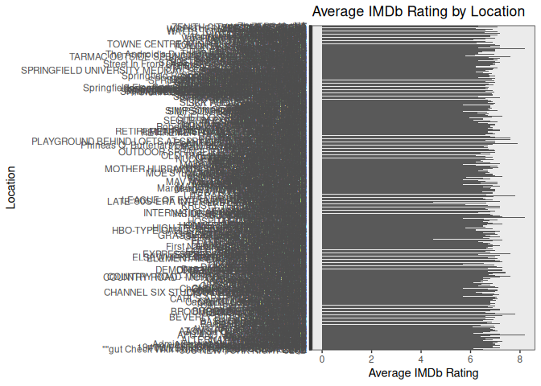
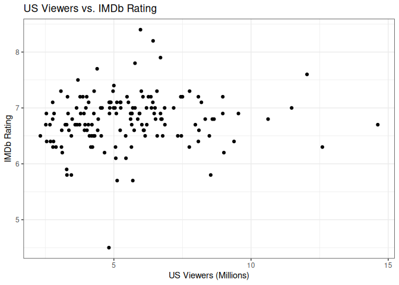

TidyTuesday: Week 5
================
Pawan

``` r
## Load necessary packages
setwd("/home/pawan/myfiles/tidy-tuesday/2025/2025-02-04/")
library(data.table)
library(ggplot2)
library(stringr)

## Load the data
tuesdata <- tidytuesdayR::tt_load('2025-02-04')
```

    ## ---- Compiling #TidyTuesday Information for 2025-02-04 ----
    ## --- There are 4 files available ---
    ## 
    ## 
    ## ── Downloading files ───────────────────────────────────────────────────────────
    ## 
    ##   1 of 4: "simpsons_characters.csv"
    ##   2 of 4: "simpsons_episodes.csv"
    ##   3 of 4: "simpsons_locations.csv"
    ##   4 of 4: "simpsons_script_lines.csv"

``` r
## Option 1: tidytuesdayR package 
## install.packages("tidytuesdayR")
simpsons_characters <- tuesdata$simpsons_characters
simpsons_episodes <- tuesdata$simpsons_episodes
simpsons_locations <- tuesdata$simpsons_locations
simpsons_script_lines <- tuesdata$simpsons_script_lines

## Option 2: Read directly from GitHub

characters <- fread("https://raw.githubusercontent.com/rfordatascience/tidytuesday/main/data/2025/2025-02-04/simpsons_characters.csv")
episodes <- fread("https://raw.githubusercontent.com/rfordatascience/tidytuesday/main/data/2025/2025-02-04/simpsons_episodes.csv")
locations <- fread("https://raw.githubusercontent.com/rfordatascience/tidytuesday/main/data/2025/2025-02-04/simpsons_locations.csv")
scripts <- fread("https://raw.githubusercontent.com/rfordatascience/tidytuesday/main/data/2025/2025-02-04/simpsons_script_lines.csv")


## Data Cleaning and Preprocessing (Important!)

## 1. Clean script lines:
names(characters)<-c("id","character_name","character_normalized_name","gender")
names(locations)<-c("id","location_name","location_normalized_name")

scripts[, normalized_text := tolower(gsub("[^[:alnum:] ]", "", raw_text))] ## Lowercase, remove punctuation
scripts <- scripts[!is.na(normalized_text) & normalized_text != ""] ## Remove NAs and empty strings
scripts <- scripts[character_id != 8290] ## Remove "All" character (group speaking)

## 2. Merge data:
setkey(scripts, character_id)
setkey(characters, id)
scripts <- merge(scripts, characters, by.x = "character_id", by.y = "id", all.x = TRUE)

setkey(scripts, episode_id)
setkey(episodes, id)
scripts <- merge(scripts, episodes, by.x = "episode_id", by.y = "id", all.x = TRUE)

setkey(scripts, location_id)
setkey(locations, id)
scripts <- merge(scripts, locations, by.x = "location_id", by.y = "id", all.x = TRUE)


## Analysis

## 1. Character with most spoken lines:
most_lines <- scripts[, .N, by = character_name][order(-N)][1:10] ## Top 10
print("Characters with most spoken lines:")
```

    ## [1] "Characters with most spoken lines:"

``` r
most_lines
```

    ##          character_name     N
    ##                  <char> <int>
    ##  1:       Homer Simpson  5640
    ##  2:       Marge Simpson  2776
    ##  3:        Bart Simpson  2685
    ##  4:        Lisa Simpson  2372
    ##  5:         Moe Szyslak   719
    ##  6: C. Montgomery Burns   644
    ##  7: Milhouse Van Houten   476
    ##  8:     Seymour Skinner   450
    ##  9:      Grampa Simpson   446
    ## 10:        Ned Flanders   407

``` r
## Dialogue volume change over seasons:
dialogue_by_season <- scripts[, .N, by = .(character_name, season)][order(season, -N)]
ggplot(dialogue_by_season, aes(x = season, y = N, fill = character_name)) +
  geom_bar(stat = "identity", position = "dodge") +
  labs(title = "Dialogue Volume by Character and Season", x = "Season", y = "Number of Lines") +
  theme_bw()
```

<!-- -->

``` r
## 2. Most frequent locations:
most_frequent_locations <- scripts[, .N, by = location_name][order(-N)][1:10]
print("\nMost frequent locations:")
```

    ## [1] "\nMost frequent locations:"

``` r
most_frequent_locations
```

    ##                       location_name     N
    ##                              <char> <int>
    ##  1:                    Simpson Home  5801
    ##  2:   Springfield Elementary School  1829
    ##  3:                    Moe's Tavern  1031
    ##  4: Springfield Nuclear Power Plant   839
    ##  5:     First Church of Springfield   326
    ##  6:                     Springfield   315
    ##  7:              Springfield Street   314
    ##  8:         Springfield Town Square   245
    ##  9:                  Bart's Bedroom   240
    ## 10:                     Burns Manor   230

``` r
## Location vs. IMDb rating (requires careful handling of NAs and potential outliers)
location_imdb <- scripts[!is.na(imdb_rating), .(avg_imdb = mean(imdb_rating),
                                                num_episodes = .N), by = location_name]
location_imdb <- location_imdb[num_episodes > 5] ## Filter locations with enough data points (e.g., > 5 episodes)
print("\nLocation vs. IMDb Rating (Locations with at least 5 episodes):")
```

    ## [1] "\nLocation vs. IMDb Rating (Locations with at least 5 episodes):"

``` r
location_imdb
```

    ##                      location_name avg_imdb num_episodes
    ##                             <char>    <num>        <int>
    ##   1:                          <NA> 6.771579           95
    ##   2:                        Street 6.731818           66
    ##   3:                           Car 7.026190          126
    ##   4: Springfield Elementary School 6.806069         1829
    ##   5:                    Auditorium 6.625000           20
    ##  ---                                                    
    ## 704:       NUCLEAR PLANT CAFETERIA 6.600000            7
    ## 705:            FIVE SEASONS HOTEL 6.600000           12
    ## 706:                      FLANDERS 6.900000           13
    ## 707:              RIVERBOAT CASINO 6.900000           24
    ## 708:                  CASINO FLOOR 6.900000           16

``` r
ggplot(location_imdb, aes(x = location_name, y = avg_imdb)) +
  geom_bar(stat = "identity") +
  coord_flip() +  ## Horizontal bar chart for readability
  labs(title = "Average IMDb Rating by Location", x = "Location", y = "Average IMDb Rating") +
  theme_bw()
```

<!-- -->

``` r
## 3. US Viewers vs. IMDb (Handling NAs is crucial)
viewers_imdb <- episodes[!is.na(imdb_rating) & !is.na(us_viewers_in_millions)]
cor_imdb_viewers <- cor.test(viewers_imdb$us_viewers_in_millions, viewers_imdb$imdb_rating)
print("\nCorrelation between US Viewers and IMDb Rating:")
```

    ## [1] "\nCorrelation between US Viewers and IMDb Rating:"

``` r
cor_imdb_viewers
```

    ## 
    ##  Pearson's product-moment correlation
    ## 
    ## data:  viewers_imdb$us_viewers_in_millions and viewers_imdb$imdb_rating
    ## t = 1.3615, df = 146, p-value = 0.1755
    ## alternative hypothesis: true correlation is not equal to 0
    ## 95 percent confidence interval:
    ##  -0.05028279  0.26846333
    ## sample estimates:
    ##       cor 
    ## 0.1119694

``` r
ggplot(viewers_imdb, aes(x = us_viewers_in_millions, y = imdb_rating)) +
  geom_point() +
  labs(title = "US Viewers vs. IMDb Rating", x = "US Viewers (Millions)", y = "IMDb Rating") +
  theme_bw()
```

<!-- -->

``` r
## 4. Common words/phrases:
word_counts <- scripts[, .N, by = normalized_text][order(-N)][1:20] ## Top 20 words
print("\nMost common words/phrases:")
```

    ## [1] "\nMost common words/phrases:"

``` r
word_counts
```

    ##                   normalized_text     N
    ##                            <char> <int>
    ##  1:   homer simpson annoyed grunt    40
    ##  2:         homer simpson woo hoo    22
    ##  3:         homer simpson shrieks    22
    ##  4:       bart simpson ay carumba    20
    ##  5:  marge simpson annoyed murmur    20
    ##  6:   homer simpson puzzled noise    17
    ##  7:        homer simpson what the    15
    ##  8:           marge simpson homer    13
    ##  9:           homer simpson moans     9
    ## 10:         bart simpson chuckles     8
    ## 11:        homer simpson chuckles     8
    ## 12:    homer simpson scared noise     7
    ## 13:                  crowd cheers     7
    ## 14:          lisa simpson screams     7
    ## 15:          nelson muntz haw haw     7
    ## 16:   bart simpson sneaky chuckle     7
    ## 17:               bart simpson no     7
    ## 18: homer simpson anguished noise     7
    ## 19:  marge simpson worried murmur     7
    ## 20:    homer simpson short scream     7
    ##                   normalized_text     N

``` r
## Word frequencies by character (example with Homer):
homer_words <- scripts[character_name == "Homer Simpson", .N, by = normalized_text][order(-N)][1:10]
print("\nHomer's most frequent words:")
```

    ## [1] "\nHomer's most frequent words:"

``` r
homer_words
```

    ##                   normalized_text     N
    ##                            <char> <int>
    ##  1:   homer simpson annoyed grunt    40
    ##  2:         homer simpson woo hoo    22
    ##  3:         homer simpson shrieks    22
    ##  4:   homer simpson puzzled noise    17
    ##  5:        homer simpson what the    15
    ##  6:           homer simpson moans     9
    ##  7:        homer simpson chuckles     8
    ##  8:    homer simpson scared noise     7
    ##  9: homer simpson anguished noise     7
    ## 10:    homer simpson short scream     7
